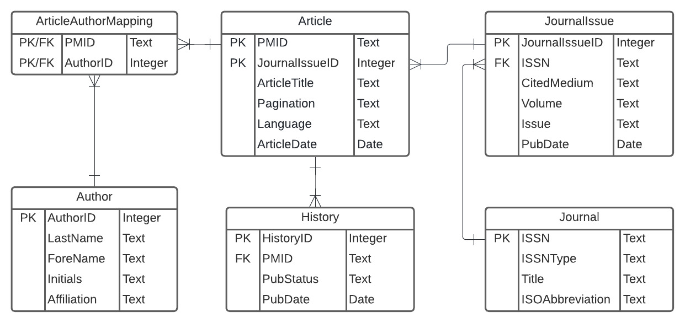
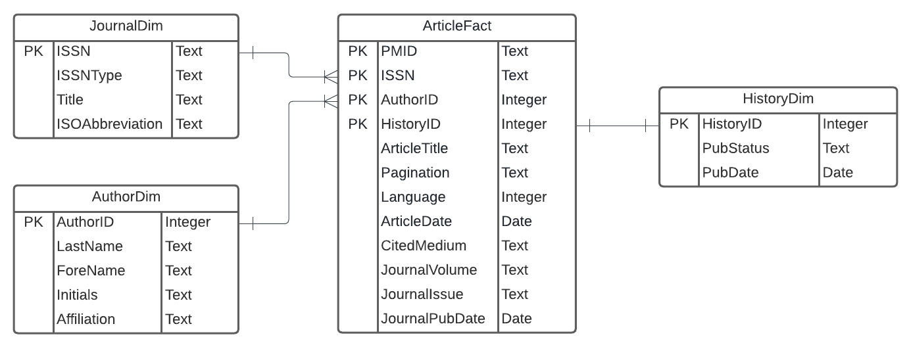
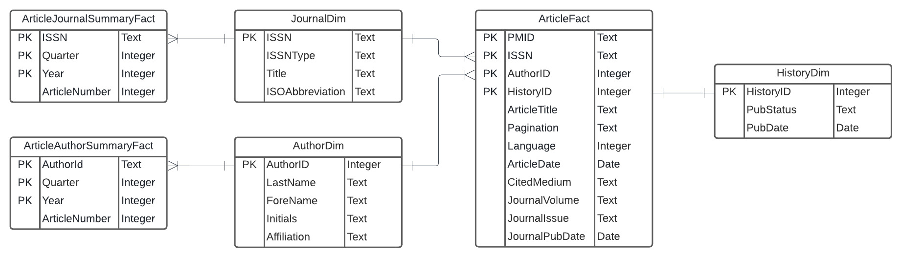

# Part 1
## Step 1
### ERD of normalized relational schema


## Step 2
### Setup
```{r}
library(XML)
library(RSQLite)

fpath <- "C:/Users/KONG/Documents/claireZ/CS5200 Database Management/Practicum II  Mine a Database/DBMSPracticum2/"
dbfile <- "Practicum2.sqlite"
xmlfile <- "pubmed_sample.xml"

# if database file already exists, we connect to it, otherwise
# we create a new database
dbcon <- dbConnect(RSQLite::SQLite(), paste0(fpath,dbfile))
#dbExecute(dbcon, "PRAGMA foreign_keys = ON")
dbListTables(dbcon)
```

### Clean up
```{sql connection = "dbcon"}
drop table if exists Article;
```

```{sql connection = "dbcon"}
drop table if exists ArticleAuthorMapping;
```

```{sql connection = "dbcon"}
drop table if exists Author;
```

```{sql connection = "dbcon"}
drop table if exists History;
```

```{sql connection = "dbcon"}
drop table if exists Journal;
```

```{sql connection = "dbcon"}
drop table if exists JournalIssue;
```

### Define Table Layout
```{sql connection ="dbcon"}
CREATE TABLE `Journal` (
  `ISSN`            Text NOT NULL PRIMARY KEY,
  `ISSNType`        Text NOT NULL,
  `Title`           Text NOT NULL,
  `ISOAbbreviation` Text NOT NULL
);
```

```{sql connection = "dbcon"}
CREATE TABLE `JournalIssue` (
  `JournalIssueID` Integer NOT NULL PRIMARY KEY AUTOINCREMENT,
  `ISSN`           Text NOT NULL,
  `CitedMedium`    Text NOT NULL,
  `Volume`         Text NOT NULL,
  `Issue`          Text NOT NULL,
  `PubDate`        Date NOT NULL,
  CONSTRAINT JournalIssue_FK0 FOREIGN KEY (ISSN)         REFERENCES Journal (ISSN)      ON DELETE CASCADE
);
```

```{sql connection ="dbcon"}
CREATE TABLE `Article` (
  `PMID`           Text NOT NULL PRIMARY KEY,
  `JournalIssueID` Integer NOT NULL,
  `ArticleTitle`   Text NOT NULL,
  `Pagination`     Text NOT NULL,
  `AbstractID`     Integer NOT NULL,
  `Language`       Text NOT NULL,
  `ArticleDate`    Date NOT NULL,
  CONSTRAINT Article_FK0 FOREIGN KEY (AbstractID)         REFERENCES Abstract (AbstractID)                     ON DELETE CASCADE,
  CONSTRAINT Article_FK1 FOREIGN KEY (JournalIssueID)     REFERENCES JournalIssue (JournalIssueID)             ON DELETE CASCADE
);
```

```{sql connection = "dbcon"}
CREATE TABLE `History` (
  `HistoryID` Integer NOT NULL PRIMARY KEY AUTOINCREMENT,
  `PMID`      Text NOT NULL,
  `PubStatus` Text NOT NULL,
  `PubDate`   Date NOT NULL,
  CONSTRAINT History_FK0 FOREIGN KEY (PMID)               REFERENCES Article (PMID)      ON DELETE CASCADE
);
```

```{sql connection = "dbcon"}
CREATE TABLE `Author` (
  `AuthorId`         Text NOT NULL PRIMARY KEY,
  `LastName`         Text NOT NULL,
  `ForeName`         Text NOT NULL,
  `Initials`         Text NOT NULL,
  `Affiliation`      Text NOT NULL
);

```

```{sql connection = "dbcon"}
CREATE TABLE `ArticleAuthorMapping` (
  `PMID`     Text NOT NULL,
  `AuthorId` Text NOT NULL,
  CONSTRAINT PublicationTypeList_FK0   FOREIGN KEY (PMID)          REFERENCES Article (PMID)      ON DELETE CASCADE,
  CONSTRAINT PArticleAuthorMapping_FK1 FOREIGN KEY (AuthorId)      REFERENCES Author (AuthorId)   ON DELETE CASCADE
);
```

## Step 3
### Process XML File
```{r }
fpn = paste0(fpath, xmlfile)
xmlDOM <- xmlParse(file = fpn)
xmlRoot <- xmlRoot(xmlDOM)
#head(xmlRoot)
```

### Define Data Frame
```{r}
History.df <- data.frame (HistoryID = integer(),
                          PMID = integer(),
                          PubStatus = character(),
                          PubDate = character(),
                          stringsAsFactors = F)

Author.df <- data.frame(AuthorID = character(),
                        LastName = character(),
                        ForeName = character(),
                        Initials = character(),
                        Affiliation = character(),
                        stringsAsFactors = F)

ArticleAuthorMapping.df <- data.frame(PMID = integer(),
                                      AuthorID = character(),
                                      stringsAsFactors =)

Journal.df <- data.frame (ISSN = character(),
                          IssnType = character(),
                          Title = character(),
                          ISOAbbreviation = character(),
                          stringsAsFactors = F)

JournalIssue.df <- data.frame ( JournalIssueID = integer(),
                                ISSN = character(),
                                CitedMedium = character(),
                                Volume = integer(),
                                Issue = integer(),
                                PubDate = character(),
                                stringsAsFactors = F)

Article.df <- data.frame (PMID = integer(),
                          JournalIssueID = integer(),
                          ArticleTitle = character(),
                          Pagination = character(),
                          Language = character(),
                          ArticleDate = character(),
                          stringsAsFactors = F)
```

### Defind Parser
```{r}
parseHistory <- function(pmid, history)
{
  rows.df <-data.frame(HistoryID = integer(),
                       PMID = character(),
                       PubStatus = character(),
                       PubDate = character(),
                       stringsAsFactors = F)

  # Use History DF record count as Auto Increment
  historyIdx <- nrow(History.df) + 10000000

  for (i in 1: xmlSize(history))
  {
    dataNode <- history[[i]]
    yy <- xpathSApply(dataNode, "Year", xmlValue)
    mm <- xpathSApply(dataNode, "Month", xmlValue)
    dd <- xpathSApply(dataNode, "Day", xmlValue)

    # Derived Field
    pubDate <- as.character(as.Date(paste(yy, mm, dd, sep="-"), format = "%Y-%m-%d"))

    # Create the "ID"
    historyIdx <- historyIdx + 1

    rows.df[i,1] <- historyIdx
    rows.df[i,2] <- pmid
    rows.df[i,3] <- xmlAttrs(dataNode, 2)
    rows.df[i,4] <- pubDate

  }

  return(rows.df)
}
```

```{r}
parseAuthor <- function(authors)
{
  rows.df <-data.frame(AuthorID = character(),
                       LastName = character(),
                       ForeName = character(),
                       Initials = character(),
                       Affiliation = character(),
                       stringsAsFactors = F)

  # Use actual row index since we skip some record if duplicated
  rowIdx = 1

  for (i in 1: xmlSize(authors))
  {
    dataNode <- authors[[i]]
    lastName <- xpathSApply(dataNode, "LastName", xmlValue)
    foreName <- xpathSApply(dataNode, "ForeName", xmlValue)
    initials <- xpathSApply(dataNode, "Initials", xmlValue)
    affiliation <- xpathSApply(dataNode, "Affiliation", xmlValue)

    authorID <- paste(lastName, initials, foreName, sep="-")

    if (length(affiliation) == 0 ) affiliation <- ''

    # If Author ID already exist in the record, skip insert
    if(!any(Author.df$AuthorID == authorID)) {
      rows.df[rowIdx,1] <- authorID
      rows.df[rowIdx,2] <- lastName
      rows.df[rowIdx,3] <- foreName
      rows.df[rowIdx,4] <- initials
      rows.df[rowIdx,5] <- affiliation
      rowIdx <- rowIdx + 1
    }
  }

  return(rows.df)
}
```

```{r}
parseArticleAuthorMapping <- function(pmid, authors)
{
  rows.df <-data.frame( PMID = integer(),
                        AuthorID = character(),
                        stringsAsFactors = F)

  for (i in 1: xmlSize(authors))
  {
    dataNode <- authors[[i]]
    lastName <- xpathSApply(dataNode, "LastName", xmlValue)
    foreName <- xpathSApply(dataNode, "ForeName", xmlValue)
    initials <- xpathSApply(dataNode, "Initials", xmlValue)

    authorID <- paste(lastName, initials, foreName, sep="-")

    rows.df[i,1] <- pmid
    rows.df[i,2] <- authorID
  }

  return(rows.df)
}
```

```{r}
parseJournal <- function(journals)
{
  rows.df <- data.frame (ISSN = character(),
                         IssnType = character(),
                         Title = character(),
                         ISOAbbreviation = character(),
                         stringsAsFactors = F)

  # Use actual row index since we skip some record if duplicated
  rowIdx = 1

  for (i in 1: xmlSize(journals))
  {
    dataNode <- journals[[i]]
    issn <- xpathSApply(dataNode, "ISSN", xmlValue)
    issnType <- xpathSApply(dataNode, "ISSN", xmlAttrs)
    title <- xpathSApply(dataNode, "Title", xmlValue)
    isoAbbreviation <- xpathSApply(dataNode, "ISOAbbreviation", xmlValue)

    if(!any(Journal.df$ISSN == issn)) {
      rows.df[rowIdx,1] <- issn
      rows.df[rowIdx,2] <- issnType
      rows.df[rowIdx,3] <- title
      rows.df[rowIdx,4] <- isoAbbreviation
      rowIdx <- rowIdx + 1
    }
  }

  return(rows.df)
}
```

```{r}
parseJournalIssue <- function(journals)
{
  rows.df <- data.frame (JournalIssueID = character(),
                         ISSN = character(),
                         CiteMedium = character(),
                         Volume = integer(),
                         Issue = integer(),
                         PubDate = character(),
                         stringsAsFactors = F)

  # Use Journal Issue DF record count as Auto Increment
  journalIdx <- nrow(JournalIssue.df) + 10000000

  for (i in 1: xmlSize(journals))
  {
    dataNode <- journals[[i]]
    issn <- xpathSApply(dataNode, "ISSN", xmlValue)
    citedMedium <- xpathSApply(dataNode, "JournalIssue", xmlAttrs)
    volume <- xpathSApply(dataNode, "JournalIssue/Volume", xmlValue)
    issue <- xpathSApply(dataNode, "JournalIssue/Issue", xmlValue)
    pubDate <- xpathSApply(dataNode, "JournalIssue/PubDate", xmlValue)

    journalIdx <- journalIdx + 1
    rows.df[i,1] <- journalIdx
    rows.df[i,2] <- issn
    rows.df[i,3] <- citedMedium
    rows.df[i,4] <- volume
    rows.df[i,5] <- issue
    rows.df[i,6] <- pubDate
  }

  return(rows.df)
}
```

```{r}
parseArticle <- function(pmid, article)
{
  rows.df <- data.frame (PMID = integer(),
                         JournalIssueID = integer(),
                         ArticleTitle = character(),
                         Pagination = character(),
                         Language = character(),
                         ArticleDate = character(),
                         stringsAsFactors = F)

  for (i in 1: xmlSize(article))
  {
      dataNode <- article[[i]]
      articleTitle = xpathSApply(dataNode, "ArticleTitle", xmlValue)
      pagination = xpathSApply(dataNode, "Pagination/MedlinePgn", xmlValue)
      language = xpathSApply(dataNode, "Language", xmlValue)
      issn = xpathSApply(dataNode, "Journal/ISSN", xmlValue)
      volume = xpathSApply(dataNode, "Journal/JournalIssue/Volume", xmlValue)
      issue = xpathSApply(dataNode, "Journal/JournalIssue/Issue", xmlValue)
      yy = xpathSApply(dataNode, "ArticleDate/Year", xmlValue)
      mm = xpathSApply(dataNode, "ArticleDate/Month", xmlValue)
      dd = xpathSApply(dataNode, "ArticleDate/Day", xmlValue)

      # Derived Field
      articleDate <- paste(yy, mm, dd, sep="-")
      if (length(articleDate) == 0) articleDate <- '1970-01-01'

      # Lookup Journal Issue ID
      index <- which(JournalIssue.df$ISSN == issn & JournalIssue.df$Volume == volume  & JournalIssue.df$Issue == issue )
      journalIssueID = JournalIssue.df[index, "JournalIssueID"]

      rows.df[i,1] <- pmid
      rows.df[i,2] <- journalIssueID
      rows.df[i,3] <- articleTitle
      rows.df[i,4] <- pagination
      rows.df[i,5] <- language
      rows.df[i,6] <- articleDate
    }

    return(rows.df)
}
```

### Main Parsing
```{r}
size <- xmlSize(xmlRoot)
for (i in 1 : size){
  node = xmlRoot[[i]]
  pmid = xmlValue(xpathSApply(node[[1]], "PMID"))

  # Process Journal
  journals = xpathApply(node[[1]], "Article/Journal")
  journalRows <- parseJournal(journals)
  if (nrow(journalRows) > 0){
    for(j in 1 : nrow(journalRows)) {
      row <- journalRows[j,]
      Journal.df[nrow(Journal.df) + 1,] = row
    }
  }

  # Process Journal Issue
  journalIssueRows <- parseJournalIssue(journals)
  if (nrow(journalIssueRows) > 0){
    for(j in 1 : nrow(journalIssueRows)) {
      row <- journalIssueRows[j,]
      JournalIssue.df[nrow(JournalIssue.df) + 1,] = row
    }
  }

  # Process History
  history = xpathApply(node[[2]], "History/PubMedPubDate")
  historyRows <- parseHistory(pmid, history)
  if (nrow(historyRows) > 0){
    for(j in 1 : nrow(historyRows)) {
      row <- historyRows[j,]
      History.df[nrow(History.df) + 1,] = row
    }
  }

  # Process Author (Record will be skipped if it was added previously)
  authors = xpathApply(node[[1]], "Article/AuthorList/Author")
  authorRows <- parseAuthor(authors)
  if (nrow(authorRows) > 0){
    for(j in 1 : nrow(authorRows)) {
      row <- authorRows[j,]
      Author.df[nrow(Author.df) + 1,] = row
    }
  }

  # Process Article Author Mapping
  articleAuthorMappingRows <- parseArticleAuthorMapping(pmid, authors)
  if (nrow(articleAuthorMappingRows) > 0){
    for(j in 1 : nrow(articleAuthorMappingRows)) {
      row <- articleAuthorMappingRows[j,]
      ArticleAuthorMapping.df[nrow(ArticleAuthorMapping.df) + 1,] = row
    }
  }

  # Process Article
  article = xpathApply(node[[1]], "Article")
  articleRows <- parseArticle(pmid, article)
  if (nrow(articleRows) > 0){
    for(j in 1 : nrow(articleRows)) {
      row <- articleRows[j,]
      Article.df[nrow(Article.df) + 1,] = row
    }
  }
}

```

```{r}
History.df
Author.df
ArticleAuthorMapping.df
Article.df
Journal.df
JournalIssue.df
```

### Write Result into database
```{r}
dbWriteTable(dbcon, "Article", Article.df, overwrite = T)
dbWriteTable(dbcon, "ArticleAuthorMapping", ArticleAuthorMapping.df, overwrite = T)
dbWriteTable(dbcon, "Author", Author.df, overwrite = T)
dbWriteTable(dbcon, "History", History.df, overwrite = T)
dbWriteTable(dbcon, "Journal", Journal.df, overwrite = T)
dbWriteTable(dbcon, "JournalIssue", JournalIssue.df, overwrite = T)
```

### Finally View the record via SQL
```{sql connection = "dbcon"}
select rowid, a.* from Article a
```

```{sql connection = "dbcon"}
select rowid, a.* from ArticleAuthorMapping a
```

```{sql connection = "dbcon"}
select rowid, a.* from Author a
```

```{sql connection = "dbcon"}
select rowid, a.* from History a
```

```{sql connection = "dbcon"}
select rowid, a.* from Journal a
```

```{sql connection = "dbcon"}
select rowid, a.* from JournalIssue a
```

# Part 2
## Step 1
### ERD of star schema


### Clean up
```{sql connection = "dbcon"}
drop table if exists ArticleFact;
```

```{sql connection = "dbcon"}
drop table if exists JournalDim;
```

```{sql connection = "dbcon"}
drop table if exists AuthorDim;
```

```{sql connection = "dbcon"}
drop table if exists HistoryDim;
```

### Create and load the dimension tables
```{sql connection ="dbcon"}
CREATE TABLE JournalDim (
  ISSN            Text NOT NULL PRIMARY KEY,
  ISSNType        Text NOT NULL,
  Title           Text NOT NULL,
  ISOAbbreviation Text NOT NULL
);
```

```{sql connection ="dbcon"}
INSERT INTO JournalDim
  SELECT ISSN, IssnType, Title, ISOAbbreviation FROM Journal;
```

```{sql connection ="dbcon"}
CREATE TABLE AuthorDim (
  AuthorId        Text NOT NULL PRIMARY KEY,
  LastName        Text NOT NULL,
  ForeName        Text NOT NULL,
  Initials        Text NOT NULL,
  Affiliation     Text NOT NULL
);
```

```{sql connection ="dbcon"}
INSERT INTO AuthorDim
  SELECT AuthorId, LastName, ForeName, Initials, Affiliation FROM Author;
```

```{sql connection ="dbcon"}
CREATE TABLE HistoryDim (
  HistoryID Integer NOT NULL PRIMARY KEY,
  PubStatus Text NOT NULL,
  PubDate   Date NOT NULL
);
```

```{sql connection ="dbcon"}
INSERT INTO HistoryDim
  SELECT HistoryID, PubStatus, PubDate FROM History;
```

### Create the fact table
```{sql connection ="dbcon"}
CREATE TABLE ArticleFact (
  PMID           Text NOT NULL,
  ISSN           Text NOT NULL,
  AuthorId       Text NOT NULL,
  HistoryID      Integer NOT NULL,
  ArticleTitle   Text NOT NULL,
  Pagination     Text NOT NULL,
  Language       Text NOT NULL,
  ArticleDate    Date NOT NULL,
  CitedMedium    Text NOT NULL,
  JournalVolume  Text NOT NULL,
  JournalIssue   Text NOT NULL,
  JournalPubDate Text NOT NULL,
  PRIMARY KEY (PMID, ISSN, AuthorId, HistoryID),
  CONSTRAINT Article_Journal_FK FOREIGN KEY (ISSN)       REFERENCES JournalDim (ISSN)      ON DELETE CASCADE,
  CONSTRAINT Article_Author_FK  FOREIGN KEY (AuthorId)   REFERENCES AuthorDim (AuthorId)   ON DELETE CASCADE,
  CONSTRAINT Article_History_FK FOREIGN KEY (HistoryID)  REFERENCES HistoryDim (HistoryID) ON DELETE CASCADE
);
```

### Insert data into the fact table
```{sql connection ="dbcon"}
INSERT INTO ArticleFact
SELECT ar.PMID,
  j.ISSN,
  aam.AuthorId,
  h.HistoryID,
  ar.ArticleTitle,
  ar.Pagination,
  ar.Language,
  ar.ArticleDate,
  ji.CitedMedium,
  ji.Volume AS JournalVolume,
  ji.Issue AS JournalIssue,
  ji.PubDate AS JournalPubDate
FROM Article ar
JOIN JournalIssue ji ON ji.JournalIssueID = ar.JournalIssueID
JOIN Journal j ON j.ISSN = ji.ISSN
JOIN ArticleAuthorMapping aam ON aam.PMID = ar.PMID
JOIN History h ON h.PMID = ar.PMID;
```

### View the record via SQL
```{sql connection = "dbcon"}
select * from JournalDim;
```

```{sql connection = "dbcon"}
select * from AuthorDim;
```

```{sql connection = "dbcon"}
select * from HistoryDim;
```

```{sql connection = "dbcon"}
select * from ArticleFact;
```

## Step 2
### ERD of star schema (Add summary fact table)


## Create the summary of journals' article number
### Clean up
```{sql connection = "dbcon"}
DROP TABLE IF EXISTS ArticleJournalSummaryFact;
```

### Create the fact table
Counting article numbers for each journal per period
```{sql connection ="dbcon"}
CREATE TABLE ArticleJournalSummaryFact (
  ISSN           Text NOT NULL,
  Quarter        Integer NOT NULL,
  YEAR           Integer NOT NULL,
  ArticleNumber  Integer NOT NULL,
  PRIMARY KEY (ISSN, Quarter, Year)
);
```

### Insert data into the fact table
Choosing PubStatus "pubmed" as publish date
```{sql connection ="dbcon"}
INSERT INTO ArticleJournalSummaryFact
SELECT DISTINCT
  ISSN,
  (2 + strftime('%m', hd.PubDate)) / 3 AS Quarter,
  strftime('%Y', hd.PubDate) AS Year,
  COUNT (DISTINCT PMID) AS ArticleNumber
FROM ArticleFact af
JOIN HistoryDim hd ON hd.HistoryID = af.HistoryID AND hd.PubStatus = 'pubmed'
GROUP BY ISSN, Year, Quarter
ORDER BY ISSN, Year, Quarter;
```

### Query data from summary fact table
count number of articles per year by journal
```{sql connection ="dbcon"}
SELECT
  ajsf.ISSN,
  jd.Title,
  ajsf.Year,
  SUM(ajsf.ArticleNumber) AS ArticleNumber
FROM ArticleJournalSummaryFact ajsf
JOIN JournalDim jd ON jd.ISSN = ajsf.ISSN
GROUP BY ajsf.ISSN, ajsf.Year;
```

## Create the summary of authors' article number
### Clean up
```{sql connection = "dbcon"}
DROP TABLE IF EXISTS ArticleAuthorSummaryFact;
```

### Create the fact table 
Counting article numbers for each author per period
```{sql connection ="dbcon"}
CREATE TABLE ArticleAuthorSummaryFact (
  AuthorId       Text NOT NULL,
  Quarter        Integer NOT NULL,
  YEAR           Integer NOT NULL,
  ArticleNumber  Integer NOT NULL,
  PRIMARY KEY (AuthorId, Quarter, Year)
);
```

### Insert data into the fact table
Choosing PubStatus "pubmed" as publish date
```{sql connection ="dbcon"}
INSERT INTO ArticleAuthorSummaryFact
SELECT DISTINCT
  af.AuthorId,
  (2 + strftime('%m', hd.PubDate)) / 3 AS Quarter,
  strftime('%Y', hd.PubDate) AS Year,
  COUNT (DISTINCT PMID) AS ArticleNumber
FROM ArticleFact af
JOIN HistoryDim hd ON hd.HistoryID = af.HistoryID AND hd.PubStatus = 'pubmed'
GROUP BY af.AuthorId, Year, Quarter
ORDER BY af.AuthorId, Year, Quarter;
```

### Query data from summary fact table
count number of articles per year by author
```{sql connection ="dbcon"}
SELECT
  aasf.AuthorId,
  ad.LastName,
  ad.ForeName,
  aasf.Year,
  SUM(aasf.ArticleNumber) AS ArticleNumber
FROM ArticleAuthorSummaryFact aasf
JOIN AuthorDim ad ON ad.AuthorId = aasf.AuthorId
GROUP BY aasf.AuthorId, aasf.Year;
```

## Step 3 Explore and mine data

### 1. How many articles are published each quarter per year from 2011-2013?
#### SQL Query
```{sql connection="dbcon"}
SELECT Year AS Year, Quarter, SUM(ArticleNumber) AS num_of_articles
  FROM ArticleJournalSummaryFact
  GROUP BY Year, Quarter;
```
#### Assign query results to a dataframe
```{r}
df_articles_quarter_year <- dbGetQuery(dbcon,
  "SELECT Year AS Year, Quarter, SUM(ArticleNumber) AS num_of_articles
    FROM ArticleJournalSummaryFact
    GROUP BY Year, Quarter;")
df_articles_quarter_year
```
#### Visualize the data
```{r}
df2 <- data.frame(supp=rep(c("2011", "2012","2013"), each=4),
                Quarter=rep(c("1st", "2nd", "3rd", "4th"), 3),
                Num_of_Articles=c(1, 0, 2, 4, 4, 2, 1, 4, 0, 0, 1, 0))
head(df2)
library(ggplot2)
# Line plot with multiple groups
p <- ggplot(data=df2, aes(x=Quarter, y=Num_of_Articles, group=supp)) +
      geom_line(aes(linetype=supp), size=1.2)+
      geom_point(aes(shape=supp), size=2.4, color='red')
p <- p + scale_color_brewer(palette="Paired")+
  theme_minimal()
p + theme(legend.position="bottom")
```

### 2. Average days between submission and publication.
#### SQL Query
```{sql connection="dbcon"}
SELECT DISTINCT
  af.PMID,
  hd.PubStatus,
  hd.PubDate
FROM ArticleFact af
JOIN HistoryDim hd ON hd.HistoryID = af.HistoryID AND hd.PubStatus IN ('received', 'pubmed')
WHERE af.PMID IN (
  SELECT DISTINCT
    af.PMID
  FROM ArticleFact af
  JOIN HistoryDim hd ON hd.HistoryID = af.HistoryID AND hd.PubStatus IN ('received', 'pubmed')
  GROUP BY af.PMID
  HAVING COUNT(DISTINCT af.HistoryID) = 2
);
```

```{sql connection="dbcon"}
SELECT
  AVG(
    CASE
      WHEN hd.PubStatus = 'received' THEN -JULIANDAY(hd.PubDate)
      ELSE JULIANDAY(hd.PubDate)
    END
  ) * 2 AS AverageDays
FROM ArticleFact af
JOIN HistoryDim hd ON hd.HistoryID = af.HistoryID AND hd.PubStatus IN ('received', 'pubmed')
WHERE af.PMID IN (
  SELECT DISTINCT
    af.PMID
  FROM ArticleFact af
  JOIN HistoryDim hd ON hd.HistoryID = af.HistoryID AND hd.PubStatus IN ('received', 'pubmed')
  GROUP BY af.PMID
  HAVING COUNT(DISTINCT af.HistoryID) = 2
);
```

### Close the connection
```{r}
dbDisconnect(dbcon)
```